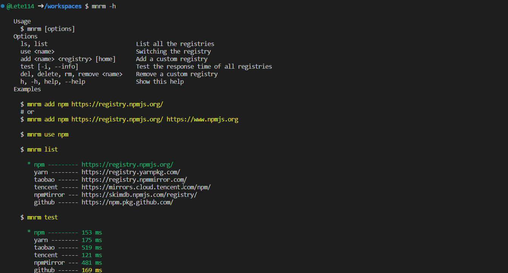

<h1 align="center">mini-nrm</h1>
<p align="center">Mini npm registry manager</p>

<p align="center">
    <a href="https://www.npmjs.com/package/mini-nrm"></a>
    <a href="https://github.com/Lete114/visitor-badge"></a>
    <a href="https://github.com/CreateWheel/mini-nrm/blob/main/LICENSE"></a>
</p>

# mini-nrm

Super lightweight npm registry manager

- **No dependencies.**
- [mini-nrm](https://packagephobia.com/result?p=mini-nrm) ~ **21kB** | [nnrm](https://packagephobia.com/result?p=nnrm) ~ **7MB** | [nrm](https://packagephobia.com/result?p=nrm) ~ **15MB**
- Customizing the registry image
- Test response speed details
- TypeScript type declarations included.
<p align="center">

</p>

## Install

```bash
npm install -g mini-nrm
```

Because it is very slim, you can use `npx` to manage the registry image directly without installing it

```bash
npx mini-nrm --help
```

## Usage

> This command does not modify the registry, it just uses the specified registry to install the dependencies
>
> It uses the `taobao` registry to install `output-line` `get-user-ip ` `body-data` `simple-unique`
```diff
-npm install output-line get-user-ip body-data simple-unique -S
+mnrm use taobao output-line get-user-ip body-data simple-unique -S
```

`mnrm --help`: Show this help

```bash
  Usage
    $ mnrm [options]
  Options
    ls, list                            List all the registries
    use <name> [package...]             Switch registry or specify registry directly to install npm packages
    add <name> <registry> [home]        Add a custom registry
    test [-i, --info]                   Test the response time of all registries
    del, delete, rm, remove <name...>   Remove a custom registry
    h, -h, help, --help                 Show this help
  Examples

    $ mnrm add npm https://registry.npmjs.org/

    $ mnrm use npm

    $ mnrm use taobao output-line get-user-ip body-data simple-unique -S

    $ mnrm list

      * npm --------- https://registry.npmjs.org/
        yarn -------- https://registry.yarnpkg.com/
        taobao ------ https://registry.npmmirror.com/
        tencent ----- https://mirrors.cloud.tencent.com/npm/
        npmMirror --- https://skimdb.npmjs.com/registry/

    $ mnrm test

      * npm --------- 153 ms
        yarn -------- 175 ms
        taobao ------ 519 ms
        tencent ----- 121 ms
        npmMirror --- 481 ms

```

## JavaScript API

```js
import mnrm from 'mini-nrm'

console.log(mnrm.list())
// output
// * npm --------- https://registry.npmjs.org/
//   yarn -------- https://registry.yarnpkg.com/
//   taobao ------ https://registry.npmmirror.com/
//   tencent ----- https://mirrors.cloud.tencent.com/npm/
//   npmMirror --- https://skimdb.npmjs.com/registry/
//   github ------ https://npm.pkg.github.com/
```
